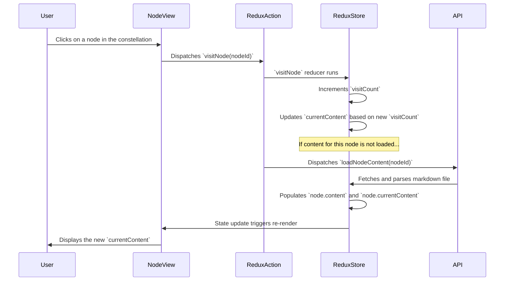

---
**Note (2025-06-08):** This implementation plan has been largely completed. The core Narramorph functionality, including multi-state content based on visit counts and the transformation engine, is now part of the prototype. Some minor deviations from this original plan (such as the exact delimiter used) were made during implementation and have been addressed in the codebase. This document serves as a record of the initial plan.
---

# Narramorph Implementation Plan

This document outlines the architectural design and implementation plan for the Narramorph feature in the "Eternal Return of the Digital Self" project.

## 1. Content Storage Strategy

To support multiple content states for each narrative node, we will adopt a new convention for our content files. Instead of one file per node, we will have one file, but with special markers to delineate different versions of the content.

### Proposed Solution: Delimited Content in Markdown

We will use a special delimiter `---[<visit_count>]` within the existing Markdown files to separate content for different visit counts. The number inside the brackets will indicate the minimum `visitCount` required to display that content.

**Example: `arch-discovery.md`**

```markdown
---[0]
This is the initial content for the "Patterns in Decay" node. The archaeologist is just beginning their investigation.

---[1]
Having visited once, the archaeologist sees things differently. The patterns are more pronounced, and a sense of unease begins to set in.

---[4]
After several visits, the distinction between the data and the archaeologist's own thoughts begins to blur. The text becomes more fragmented and introspective.
```

*   A visit count of `0` will be used for the initial, unvisited state.
*   The content loader will parse this file and select the content that corresponds to the current `visitCount` of the node. The loader will select the content with the highest `visit_count` delimiter that is less than or equal to the node's `visitCount`.

### Rationale

*   **Keeps related content together:** All states for a single node are in one file, making it easier for writers to see the progression and maintain narrative consistency.
*   **Minimizes file system changes:** We don't need to create a large number of new files.
*   **Extensible:** This format can easily accommodate more complex rules in the future, such as conditions based on which other nodes have been visited.

## 2. State Management (Redux Store)

The changes to the Redux store will be focused on `nodesSlice.ts` and the related types in `types/index.ts`.

### `src/types/index.ts` Changes

We will introduce a new type to hold the multiple content states for a node.

```typescript
// In src/types/index.ts

export interface NarramorphContent {
  [visitCount: number]: string;
}

export interface NodeState extends Node {
  visitCount: number;
  // Time-based features removed (2025-06-08)
  currentState: NodeVisualState;
  revealedConnections: string[];
  transformations: TransformationRule[];
  content: NarramorphContent | null; // Holds all content versions
  currentContent: string | null; // The currently displayed content
}
```

### `src/store/slices/nodesSlice.ts` Changes

1.  **Update `NodesState`**: The `NodeState` within the `data` record will be updated to include the new `content` and `currentContent` fields.

2.  **Modify `initializeNodes`**: The `initializeNodes` extra reducer will be updated to initialize `content` and `currentContent` to `null`.

3.  **Enhance `loadNodeContent`**: The `loadNodeContent` async thunk will be the centerpiece of the new logic.

    *   It will fetch the content from the `contentSource` markdown file.
    *   It will parse the file and populate the `content` field in the `NodeState` with a `NarramorphContent` object.
    *   It will set the `currentContent` based on the node's current `visitCount`.

4.  **Update `visitNode`**: When `visitNode` is called, after incrementing `visitCount`, it will need to update `currentContent` from the `content` object.

```typescript
// In src/store/slices/nodesSlice.ts

// ... imports

// In visitNode reducer
visitNode: (state, action: PayloadAction<string>) => {
  const nodeId = action.payload;
  const node = state.data[nodeId];

  if (node) {
    node.visitCount += 1;
    // Time-based tracking removed (2025-06-08)

    // ... existing currentState logic

    if (node.content) {
      const availableCounts = Object.keys(node.content)
        .map(Number)
        .sort((a, b) => b - a);
      const bestMatch = availableCounts.find(count => node.visitCount >= count);
      if (bestMatch !== undefined) {
        node.currentContent = node.content[bestMatch];
      }
    }
  }
},

// In extraReducers for loadNodeContent.fulfilled
builder.addCase(loadNodeContent.fulfilled, (state, action) => {
  const { nodeId, content } = action.payload;
  const node = state.data[nodeId];
  if (node) {
    node.content = content;
    // Set initial content
    const availableCounts = Object.keys(node.content)
      .map(Number)
      .sort((a, b) => b - a);
    const bestMatch = availableCounts.find(count => node.visitCount >= count);
    if (bestMatch !== undefined) {
      node.currentContent = node.content[bestMatch];
    }
  }
  state.loading = false;
});
```

## 3. Content Loading and Rendering

### Content Loading (`loadNodeContent`)

The `loadNodeContent` async thunk will be responsible for fetching and parsing the markdown content.

```typescript
// In src/store/slices/nodesSlice.ts

export const loadNodeContent = createAsyncThunk(
  'nodes/loadContent',
  async (nodeId: string, { getState, rejectWithValue }) => {
    try {
      const state = getState() as RootState;
      const node = state.nodes.data[nodeId];
      const response = await fetch(`/src/content/${node.contentSource}`);
      const text = await response.text();

      const content: NarramorphContent = {};
      const parts = text.split(/---t\[(\d+)\]/);

      let currentVisitCount = 0;
      for (let i = 1; i < parts.length; i += 2) {
          currentVisitCount = parseInt(parts[i], 10);
          content[currentVisitCount] = parts[i + 1].trim();
      }
      if (Object.keys(content).length === 0) {
        // Fallback for files without delimiters
        content[0] = text.trim();
      }


      return { nodeId, content };
    } catch (error) {
      return rejectWithValue(`Failed to load content for node ${nodeId}`);
    }
  }
);
```

### Rendering (`NodeView.tsx`)

The `NodeView.tsx` component will be simplified. It will no longer need to fetch content itself. It will get the `currentContent` from the Redux store and render it.

```tsx
// In src/components/NodeView/NodeView.tsx

import { useSelector } from 'react-redux';
import { RootState } from '../../store';
import ReactMarkdown from 'react-markdown';

const NodeView = () => {
  const activeNodeId = useSelector((state: RootState) => state.reader.currentNodeId);
  const node = useSelector((state: RootState) => activeNodeId ? state.nodes.data[activeNodeId] : null);

  if (!node) {
    return <div>Select a node to view its content.</div>;
  }

  return (
    <div className="node-view">
      <h2>{node.title}</h2>
      <ReactMarkdown>{node.currentContent || 'Loading...'}</ReactMarkdown>
    </div>
  );
};

export default NodeView;
```

## 4. Data Flow

Here is the end-to-end data flow for the Narramorph feature:



This plan provides a clear path forward for implementing the Narramorph feature. It is designed to be robust, maintainable, and consistent with the existing architecture of the application.